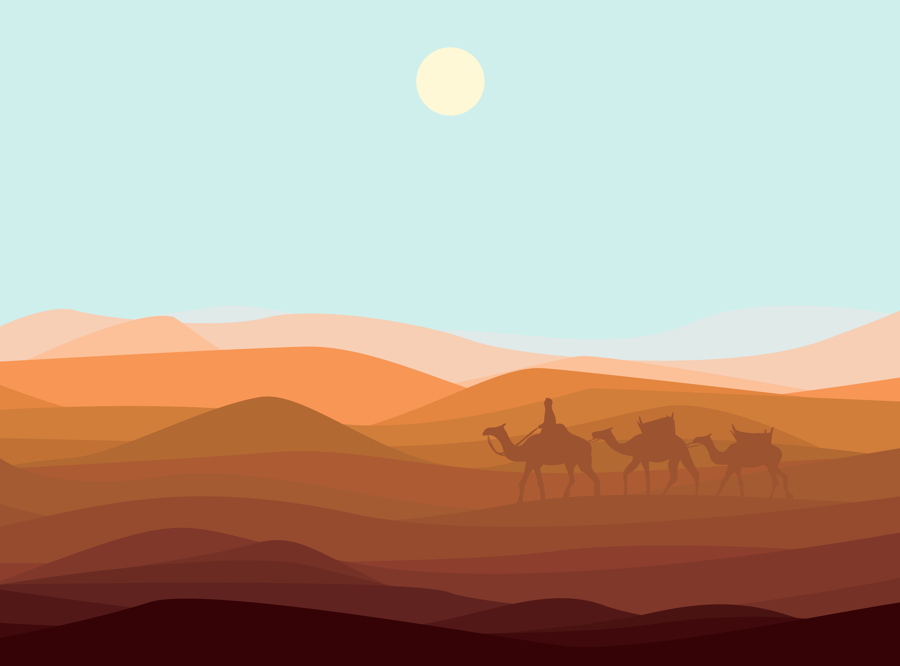

<!-- Sand‑Desert Banner with Camels -->
<p align="center">
  
</p>

<h1 align="center" style="color: #C5833C; font-family: 'Segoe UI', sans-serif;">
  🏜️ Pradhuman Thanvi | Maru Bhumi
</h1>

<h3 align="center" style="color: #A66E3A;">
  Building Life‑Changing Solutions
</h3>

---

## 🌄 About Me

> Inventor, explorer, and builder.  
> I build at the intersection of ideas, code, and hardware — forging real impact in the desert of possibility.

- 👨‍💻 Web & Hardware Developer  
- 🧑‍🎓 Forever a Student  
- 🛠️ Raspberry Pi & Arduino tinkerer  
- 🚀 Creative problem‑solver

---

## 🏺 Tech Stack

<p align="center">
  <b style="color: #8A5A2B;">Languages & Platforms</b><br/>
  
</p>

---

## 🌟 Featured Projects

| Project | Description |
|--------|-------------|
| [**Maru Bhumi**](https://github.com/pradhuman-thanvi/maru-bhumi) | 🏜️ A tribute to desert spirit & culture |
| [**DDoor**](https://github.com/pradhuman-thanvi/DDoor) | 🌍 Hyperlocal services platform |
| [**Buzzio**](https://github.com/pradhuman-thanvi/Buzzio) | 🔔 Smart buzzer & alert system |
| [**Frame-Memory**](https://github.com/pradhuman-thanvi/Frame-Memory) | 🖼️ Creative memory‑framing app |
| [**Clothing_Brand_website**](https://github.com/pradhuman-thanvi/Clothing_Brand_website) | 👗 Stylish web presence for a fashion brand |
| [**earth-h2o.com**](https://github.com/pradhuman-thanvi/earth-h2o.com) | 💧 Alkaline water brand project |

---

## 📚 Focus Areas

- 🔧 Deepening Python & system skills  
- 🤖 IoT integrations (Arduino / Pi)  
- 🎨 Strong UX/UI for meaningful impact  
- 🧠 Product & creative design thinking  

---

## 📬 Let’s Connect

<p align="center">
  <a href="https://in.linkedin.com/in/pradhuman-thanvi-628869371">
    
  </a>
  
</p>

---

**“BUILDING LIFE‑CHANGING SOLUTIONS”**  
<p align="center">In the heart of Maru Bhumi 🌵</p>

---

## 🎨 Tips for Implementation

- Use a **high resolution**, wide **desert + camel banner**. Make sure it’s not too tall (so page doesn’t scroll too much).
- Stick to a **warm sand / ochre / terracotta palette** (e.g. `#C5833C, #A66E3A, #8A5A2B, #F0E0B0`) for text or accent colors.
- Use **rounded corners / soft edges** for visuals to match a “soft dunes” feel.
- You can animate shadows or overlays (semi-transparent gradient) over the banner to improve readability.

---
PROJECT - MARU BHUMI | DDOOR
```
